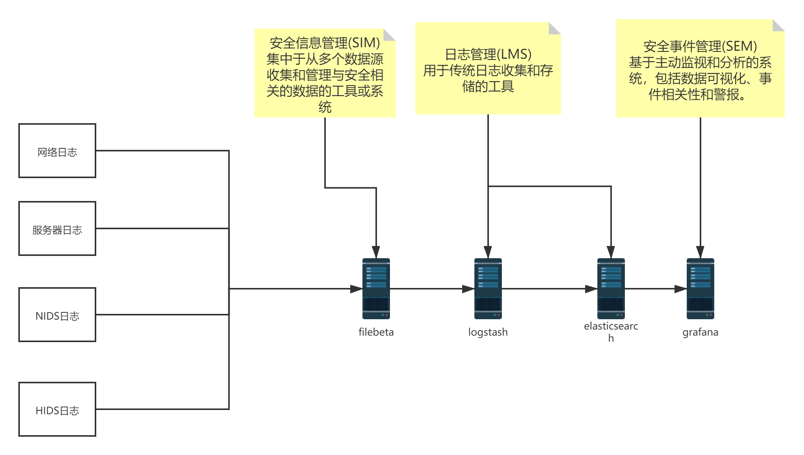

# 初识SIEM

## ~~安全监控~~

~~安全监控是指使用安全监控系统或者产品实时对主机系统和网络环境的行为变化进行监控，其中包括文件系统变化、用户操作安全审计、软件配置安全基线、木马病毒特征识别、感知记录外部攻击行为、风险告警等功能。通过多个维度交织在一起，从而让安全工程师能够把握全局变化，做到风险可控，保证主机系统的安全性和稳定性。~~

~~安全监控系统的原理是入侵检测系统（Intrusion Detection System），其中分为两种类型：**主机入侵检测系统**（Host-based Intrusion Detection System）和**网络入侵检测系统**（Network Intrusion Detection System）。主机入侵检测系统和网络入侵检测系统的区别是面向群体不同，主机入侵检测系统是关注主机系统内部的变化和外部输入的监控；网络入侵检测系统则是关注不同的流量输入和输出的过程中是否存在异常行为。~~

~~在中小型互联网公司，企业考虑到用人成本问题，安全工程师的用人额度往往只有一个，也就是行内笑称“一个人的安全部”，一个人做的东西是非常有限的，而且用于建设安全体系的安全预算并没有多少。对于如何建立起安全体系中的安全监控体系，需要一个完整的构建部署方案。一个成功的方案需要从需求分析、系统选型、功能特点、成本效益这几个方面入手，接下来来说说具体细节。~~

~~第一，为什么需要安全监控？由于攻防信息不对称，作为防守方的我们，永远不知道黑客会从那个薄弱环节进入到你的服务器里面搞破坏。比如说对外服务器有个redis服务存在未授权漏洞写公钥登录漏洞，黑客可以写入公钥通过SSH端口直接进入服务器，而作为管理员的你黑客这一行为是不可知的，除非黑客把代码、数据库删除或者使用挖矿病毒将服务器的CPU跑满导致业务系统宕掉，这时候你才后知后觉，导致所造成的损失就非常大。然后真正的黑客只会偷偷打枪，在不触动正常的服务器资源告警的情况下，将你公司所有的服务器全部搞下来，数据和代码统统拖走。无论作为事前预防还是作为事后补救，安全监控都是必须的。~~

~~第二，关于安全监控的系统选型这一方面，我相信很多甲方工程师所在的企业中的安全预算也不多，不足以购买商业版的安全监控产品，所以也只能选择开源产品。在开源社区可以发现，ossec是最早到相对成熟的HIDS系统，也是众多商业安全监控产品的参考模板，但是随着ossec的逐渐发展，其功能不能满足免费用户的需要，因为ossec开始走向商业化。于是根据ossec这条主线，新建了一条分支：wazuh，这个产品是本文的主角，其功能、集成能力、扩展能力非常强。后续同程YSRC也开发出一款叫驭龙HIDS系统，因为其涉及到底层调用，检测颗粒度会比较细，入侵特征库也比较完善，可惜的是该系统官方已经放弃维护更新，该系统适合HIDS安全开发工程师进行参考。wazuh相对于驭龙其底层调用的攻击特征库还是很少，这个我会在后面的章节详细的聊，但是作为一个优秀的HIDS，它是卓卓有余的。~~

~~第三，功能特点，第一代的ossec，在官方文档有文件完整性监控\(FIM\)、rootkit检测以及主动防御，而第二代的wazuh继承了ossec的功能，并且在其基础上发展了更多的功能，比如是安全基线功能、软件漏洞版本检测等功能。~~

~~第四，成本效益，由于wazuh本身就是开源产品，不产生任何的安全成本，加上使用的时候只需使用管理端进行控制代理端，减少维护成本。众所周知，安全部门是一个成本部门，如果在算年终绩效的时候，在安全监控投入成本很少，公司和个人都收益非常高，因为可以使用wazuh集成到日志分析工具，统计其攻击情况和攻击趋势。~~

~~为了达到安全监控和应急响应效果，需要建设SIEM体系，甚至后期是建设SOC体系。~~

## SIEM

      SIEM是指安全信息与事件管理（Security Information and Event Management），对企业信息资产产生的日志信息（包括不限于服务器日志、业务系统日志、网络流量日志等）进行收集、处理、存储、告警、统计、可视化。其中siem由以下内容组成：

* **安全信息管理\(SIM\)** ，集中于从多个数据源收集和管理与安全相关的数据的工具或系统。
* **日志管理\(LMS\)** ，用于传统日志收集和存储的工具。
* **安全事件管理\(SEM\)** ，基于主动监视和分析的系统，包括数据可视化、事件相关性和警报。

      简单来说，服务器安装一个收集本地日志服务或者通过网络方式（UDP/TCP）投递到一个日志处理服务上面，日志处理服务处理完成之后，将日志按照特定的格式保存在数据仓库里面，然后根据自己的需求对日志内容进行告警发送和统计分析，最后输出统计报表。

      具体SIEM框架图如下：

