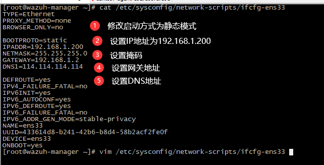

# Centos 7安装

第一步，给centos7系统设置静态IP为192.168.1.200，在/etc/sysconfig/network-scripts/ifcfg-ens33文件添加如下图所示的五行记录。



第二步，使用/etc/init.d/network restart命令重启网络，接着使用ifconfig命令查看该服务器IP地址是否为192.168.1.200。


第三步，安装wazuh管理端，在centos7系统中安装wazuh管理端软件有两种方法，一种是使用官方软件仓库源进行安装，另外一种直接到官方仓库找到地址下载回来安装，后续的软件安装也是按照这两个流程思路去解决，不再展开说。

①使用官方软件仓库源的方式，使用rpm --import导入wazuh官方软件仓库包公钥，用于在安装时校验软件包是否时官方还是被篡改了

```text
# rpm --import https://packages.wazuh.com/key/GPG-KEY-WAZUH
```

接着导入wazuh仓库文件，往里面填写相关仓库连接信息。

```text
# cat > /etc/yum.repos.d/wazuh.repo << EOF
[wazuh]
gpgcheck=1
gpgkey=https://packages.wazuh.com/key/GPG-KEY-WAZUH
enabled=1
name=EL-$releasever - Wazuh
baseurl=https://packages.wazuh.com/4.x/yum/
protect=1
EOF
```

最后，直接使用yum命令进行安装wazuh管理端。

```text
# yum install wazuh-manager
```


②由于wazuh仓库地址在外网，**yum安装的下载速度比较慢**，可以使用迅雷下载工具，直接快速下载到本地上面，并且将其上传上服务器，在官方仓库找到相应系统的rpm包，复制其下载链接进行下载。

```text
https://packages.wazuh.com/4.x/yum/wazuh-manager-4.1.5-1.x86_64.rpm
```

使用rpm命令进行安装

```text
[root@localhost opt]# rpm -ivh wazuh-manager-4.1.5-1.x86_64.rpm 
Preparing...                          ################################# [100%]
Updating / installing...
   1:wazuh-manager-4.1.5-1            ################################# [100%]
```

安装wazuh服务端之后，**需要设置开机启动和启动服务。**

```text
[root@wazuh-manager ~]# systemctl daemon-reload
[root@wazuh-manager ~]# systemctl enable wazuh-manager
Created symlink from /etc/systemd/system/multi-user.target.wants/wazuh-manager.service to /usr/lib/systemd/system/wazuh-manager.service.
[root@wazuh-manager ~]# systemctl start wazuh-manager
```

查看wazuh服务端服务是否起来

```text
[root@wazuh-manager ~]# systemctl status wazuh-manager
● wazuh-manager.service - Wazuh manager
   Loaded: loaded (/usr/lib/systemd/system/wazuh-manager.service; enabled; vendor preset: disabled)
   Active: active (running) since Fri 2021-06-25 09:32:07 EDT; 38s ago
  Process: 2760 ExecStart=/usr/bin/env ${DIRECTORY}/bin/ossec-control start (code=exited, status=0/SUCCESS)
   CGroup: /system.slice/wazuh-manager.service
           ├─2815 /var/ossec/framework/python/bin/python3 /var/ossec/api/scripts/wazuh-apid.py
           ├─2856 /var/ossec/bin/ossec-authd
           ├─2872 /var/ossec/bin/wazuh-db
           ├─2896 /var/ossec/bin/ossec-execd
           ├─2911 /var/ossec/bin/ossec-analysisd
           ├─2946 /var/ossec/bin/ossec-syscheckd
           ├─2967 /var/ossec/bin/ossec-remoted
           ├─2999 /var/ossec/bin/ossec-logcollector
           ├─3018 /var/ossec/bin/ossec-monitord
           └─3039 /var/ossec/bin/wazuh-modulesd

Jun 25 09:31:57 localhost.localdomain env[2760]: Started wazuh-db...
Jun 25 09:31:58 localhost.localdomain env[2760]: Started ossec-execd...
Jun 25 09:31:59 localhost.localdomain env[2760]: Started ossec-analysisd...
Jun 25 09:32:00 localhost.localdomain env[2760]: Started ossec-syscheckd...
Jun 25 09:32:02 localhost.localdomain env[2760]: Started ossec-remoted...
Jun 25 09:32:03 localhost.localdomain env[2760]: Started ossec-logcollector...
Jun 25 09:32:04 localhost.localdomain env[2760]: Started ossec-monitord...
Jun 25 09:32:05 localhost.localdomain env[2760]: Started wazuh-modulesd...
Jun 25 09:32:07 localhost.localdomain env[2760]: Completed.
Jun 25 09:32:07 localhost.localdomain systemd[1]: Started Wazuh manager.

```


